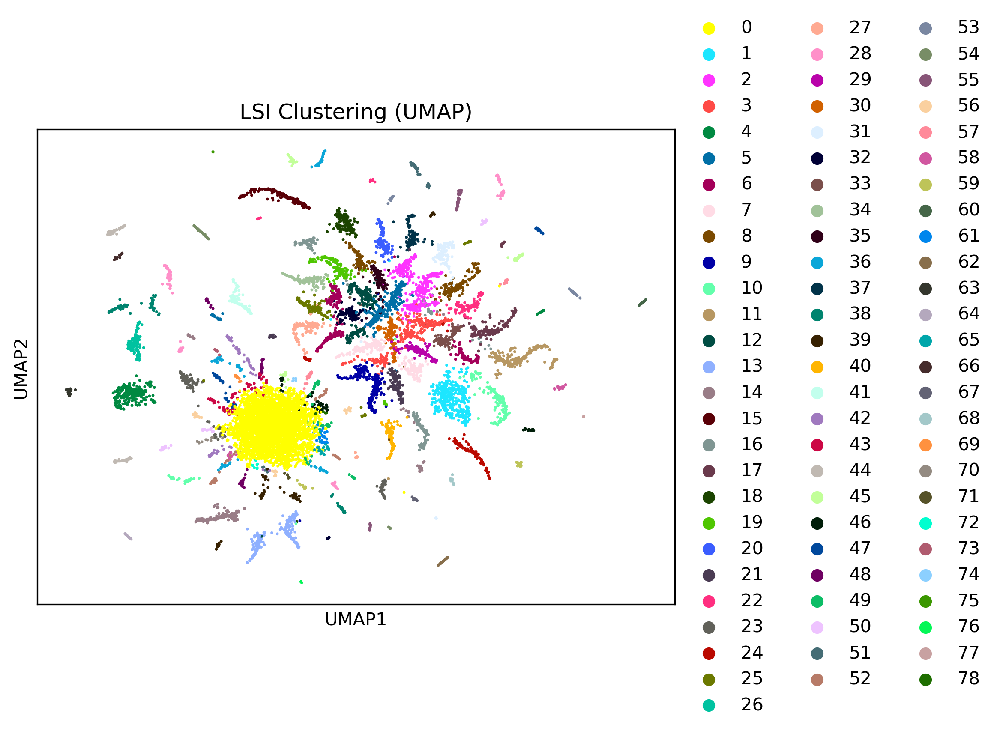

# 一、系统发育树（原R代码）

## 1.设置 redeemR 对象

### 1.1`redeemR.read`

**输入文件**：

- `QualifiedTotalCts` 存储每个细胞每个位置的四种线粒体 DNA 覆盖信息。
- `RawGenotypes.*.StrandBalance` 存储基因型信息和一致性水平等。

**输出文件**：

`VariantsGTSummary.RDS` 信息包括细胞条形码（Cell）、位置参考等位基因 / 变异等位基因（Variants）、突变等位基因数量（Freq）、总捕获等位基因数量（depth）、突变类型（type）、突变背景（Context）、异质性（hetero）

|  | **Var1** | **Cell** | **Variants** | **Freq** | **depth** | **Type** | **Context** | **hetero** |
| --- | --- | --- | --- | --- | --- | --- | --- | --- |
|  | **<fct>** | **<chr>** | **<chr>** | **<int>** | **<dbl>** | **<chr>** | **<chr>** | **<dbl>** |
| **1** | AAACAAGCACCTCGAC_10626_T_G | AAACAAGCACCTCGAC | 10626_T_G | 8 | 26 | T_G | CTC | 0.30769231 |
| **2** | AAACAAGCACCTCGAC_11164_A_T | AAACAAGCACCTCGAC | 11164_A_T | 1 | 35 | A_T | CTA | 0.02857143 |
| **3** | AAACAAGCACCTCGAC_11545_T_A | AAACAAGCACCTCGAC | 11545_T_A | 1 | 37 | T_A | TTG | 0.02702703 |
- **源代码**
    
    ```r
    #' Function to generate GTS summary
    #'
    #' This function allows you to summarize the meta data for each genotyped variant
    #' @param RawGenotypes Well-named "RawGenotypes.Sensitive.StrandBalance" file in function redeemR.read or CW_mgatk.read
    #' @param filterN Boolean variable, if true filter out the variant with "N"
    #' @return Genotypes.summary a dataframe that summarize several metrics for each genotype
    #' @examples Usually used inside of function CW_mgatk.read
    #' @export
    #' @import dplyr
    GTSummary<-function(RawGenotypes,filterN=T){ ## At this moment, the context with N is probably prone to error due to mapping, in the future should work on realignment
    # 构建覆盖深度字典（Depthdic）
    data(ContextsDic)
    Depth<-unique(RawGenotypes[,c("Cell","Pos","Depth")])
    Depthdic<-Depth$Depth
    names(Depthdic)<-paste(Depth$Cell, Depth$Pos,sep="")
    # 统计突变出现次数，Cell和Variants
    Genotypes.summary<-table(paste(RawGenotypes$Cell,RawGenotypes$Variants,sep="_")) %>% as.data.frame()
    # 拆分字符串提取信息，从Cell和Variants的组合字符串（Var1）中拆分出Cell、Variants、cellPos
    Genotypes.summary$Cell<-strsplit(as.character(Genotypes.summary$Var1),"_") %>% sapply(.,function(x){x[1]})
    Genotypes.summary$Variants<-strsplit(as.character(Genotypes.summary$Var1),"_") %>% sapply(.,function(x){paste(x[2:4],collapse="_")})
    Genotypes.summary$cellPos<-strsplit(as.character(Genotypes.summary$Var1),"_") %>% sapply(.,function(x){paste(x[1:2],collapse="")})
    # 补充关键指标
    Genotypes.summary$depth<-Depthdic[Genotypes.summary$cellPos]
    Genotypes.summary<-Genotypes.summary[,c("Var1","Cell","Variants","Freq","depth")]
    Genotypes.summary$Type<-strsplit(Genotypes.summary$Variants,"_") %>% sapply(.,function(x){paste(x[2],x[3],sep="_")})
    Genotypes.summary$Context<-ContextsDic[strsplit(Genotypes.summary$Variants,"_") %>% sapply(.,function(x){x[1]})]
    # 过滤低质量数据
    if(filterN){
        Genotypes.summary<-subset(Genotypes.summary,!grepl("N",Genotypes.summary$Context))
    }
    return(Genotypes.summary)
    }
    ```
    
- **python 代码**
    
    ```python
    def gt_summary(raw_genotypes, contexts_dic, filter_n=True):
        """
        生成每个基因型变体的元数据摘要，等效于R中的GTSummary函数
        
        参数:
            raw_genotypes: DataFrame，原始基因型数据（类似RawGenotypes.Sensitive.StrandBalance），需包含"Cell", "Pos", "Depth", "Variants"列
            contexts_dic: dict，位置-突变上下文字典（键为位置字符串，值为上下文序列）
            filter_n: bool，是否过滤Context中包含"N"的行
        
        返回:
            genotypes_summary: DataFrame，汇总后的基因型元数据
        """
        # 1. 构建覆盖深度字典（Depthdic）：键为Cell+Pos（无分隔符），值为Depth
        # 提取Cell、Pos、Depth的唯一组合
        depth_unique = raw_genotypes[["Cell", "Pos", "Depth"]].drop_duplicates()
        # 生成键：Cell和Pos拼接（无分隔符），值为Depth
        depth_dict = {f"{row['Cell']}{row['Pos']}": row['Depth'] for _, row in depth_unique.iterrows()}
        
        # 2. 统计每个Cell-Variants组合的出现次数（Freq）
        # 按Cell和Variants分组计数
        count_df = raw_genotypes.groupby(["Cell", "Variants"]).size().reset_index(name="Freq")
        # 生成Var1：Cell_Variants（用下划线连接）
        count_df["Var1"] = count_df["Cell"] + "_" + count_df["Variants"]
        
        # 3. 提取Pos（从Variants中拆分，Variants格式为"Pos_ref_alt"）
        count_df["Pos"] = count_df["Variants"].apply(lambda x: x.split("_")[0])
        
        # 4. 生成cellPos（Cell和Pos拼接，无分隔符），用于查询深度
        count_df["cellPos"] = count_df["Cell"] + count_df["Pos"]
        
        # 5. 补充depth（从depth_dict中查询）
        count_df["depth"] = count_df["cellPos"].map(depth_dict)
        
        # 6. 提取Type（突变类型，格式为"ref_alt"）
        count_df["Type"] = count_df["Variants"].apply(lambda x: "_".join(x.split("_")[1:3]))
        
        # 7. 补充Context（从contexts_dic中查询）
        count_df["Context"] = count_df["Pos"].map(contexts_dic)
        
        # 8. 过滤Context中包含"N"的行（若filter_n=True）
        if filter_n:
            # 排除Context含"N"或为空的行
            count_df = count_df[~count_df["Context"].str.contains("N", na=True)]
        
        # 9. 选择目标列并返回（与R结果列顺序一致）
        genotypes_summary = count_df[["Var1", "Cell", "Variants", "Freq", "depth", "Type", "Context"]]
        
        return genotypes_summary
    ```
    

### 1.2`Create_redeemR`

`redeemR` 对象充当一个容器，包含 ReDeeM 数据集的数据（如突变基因型）和分析结果（如克隆距离或系统发育结果）。

- `GTsummary.filtered` ：经过筛选的基因型信息，其中每一行代表给定细胞中的一个突变。

|  | **Var1** | **Cell** | **Variants** | **Freq** | **depth** | **Type** | **Context** | **hetero** |
| --- | --- | --- | --- | --- | --- | --- | --- | --- |
|  | **<fct>** | **<chr>** | **<chr>** | **<int>** | **<dbl>** | **<chr>** | **<chr>** | **<dbl>** |
| **1** | AAACAAGCACCTCGAC_10626_T_G | AAACAAGCACCTCGAC | 10626_T_G | 8 | 26 | T_G | CTC | 0.30769231 |
| **2** | AAACAAGCACCTCGAC_11164_A_T | AAACAAGCACCTCGAC | 11164_A_T | 1 | 35 | A_T | CTA | 0.02857143 |
- `V.fitered` ：经过筛选的基因型特征信息，其中每一行代表所有细胞中的一个突变

|  | **Variants** | **CellN** | **PositiveMean** | **maxcts** | **CellNPCT** | **TotalVcount** | **TotalCov** | **totalVAF** | **CV** | **HomoTag** |
| --- | --- | --- | --- | --- | --- | --- | --- | --- | --- | --- |
|  | **<chr>** | **<int>** | **<dbl>** | **<int>** | **<dbl>** | **<int>** | **<dbl>** | **<dbl>** | **<dbl>** | **<chr>** |
| **6** | 1000_T_C | 9 | 0.0328861 | 8 | 0.0014153169 | 22 | 451310 | 4.874698e-05 | 0.008177771 | Hetero |
| **11** | 10001_T_C | 3 | 0.0705272 | 12 | 0.0004717723 | 14 | 385839 | 3.628456e-05 | 0.122017337 | Hetero |
- **参数**
    - **Variants**突变的唯一标识，通常格式为 “位置_参考碱基_突变碱基”（如`1000_T_C`），表示 mtDNA 上第 1000 位的碱基由 T 突变为 C。
    - **CellN**该突变被检测到的细胞数量（Number of cells with the variant）。例如`CellN=9`表示该突变在 9 个细胞中出现过。
    - **PositiveMean**该突变在所有阳性细胞（即检测到该突变的细胞）中的平均异质性水平（mean heteroplasmy）。异质性（heteroplasmy）是指突变等位基因占该位置总等位基因的比例（即`hetero`列的值），`PositiveMean`反映该突变在不同细胞中的平均频率。
    - **maxcts**该突变在所有细胞中的最大覆盖深度（maximum depth across cells）。覆盖深度（depth）是指测序中覆盖该 mtDNA 位置的总 reads 数，`maxcts`代表该突变在单个细胞中被覆盖的最高次数。
    - **CellNPCT**携带该突变的细胞数占 “合格细胞总数” 的百分比（Percentage of qualified cells with the variant），计算公式为 `(CellN / QualifiedCellN) × 100`。例如`CellNPCT=0.0014`表示该突变仅在 0.14% 的合格细胞中出现。
    - **TotalVcount**该突变在所有细胞中的总突变等位基因数（total variant allele counts across cells），即所有细胞中`Freq`列的总和（`Freq`是单个细胞中该突变的等位基因数）。
    - **TotalCov**该突变在所有细胞中的总覆盖深度（total coverage across cells），即所有细胞中`depth`列的总和，反映该突变在所有细胞中的整体测序覆盖量。
    - **totalVAF**该突变的总变异等位基因频率（total Variant Allele Frequency），计算公式为 `TotalVcount / TotalCov`，反映该突变在所有细胞中的整体频率（而非单个细胞的异质性）。
    - **CV**变异系数（Coefficient of Variation），计算公式为 “该突变在不同细胞中异质性（hetero）的标准差 / PositiveMean”。CV 反映该突变的异质性在不同细胞中的波动程度：CV 越小，说明突变频率在细胞间越稳定；CV 越大，说明波动越剧烈。
    - **HomoTag**用于标记该突变是 “纯质性（Homoplasmy）” 还是 “异质性（Heteroplasmy）”：
        - 纯质性突变（`Homo`）：通常在大多数细胞中出现，且异质性接近 100%（即几乎所有该位置的等位基因都是突变型），可能是种系突变或早期克隆突变。
        - 异质性突变（`Hetero`）：仅在部分细胞中出现，或异质性较低（如 < 50%），通常是体细胞突变或后期克隆突变。
- **源代码**
    
    ```r
    #' Create_redeemR
    #'
    #' This function is to create redeemR with basic information
    #' @param VariantsGTSummary simply put GTSummary (Generated by redeemR.read) 
    #' @param qualifiedCellCut The minimum median mitochondrial coverage for a qualified cell, default is 10
    #' @param OnlyHetero If only consider the heteroplasmy variants, default is T
    #' @param VAFcut only use variants with VAF smaller than VAFcut. Default is 1.  We can use smaller value to constrain into only using rare variants
    #' @param Cellcut only use variants with at least cellcut cells carry
    #' @param maxctscut only use variants with at least in one cell with at leaset maxctscut variant fragments
    #' @return redeemR class
    Create_redeemR<-function(VariantsGTSummary=VariantsGTSummary,qualifiedCellCut=10,VAFcut=1,Cellcut=2,maxctscut=2){
    # 提取边缘修剪参数（edge_trim）,用于后续的序列边缘修剪
     if ("edge_trim" %in% names(attributes(VariantsGTSummary))){
            edge_trim <- as.numeric(attr(VariantsGTSummary,"edge_trim"))
        }else{
            edge_trim <- 0
        }
    # 筛选合格细胞（CellMeta）
    CellMeta<-subset(attr(VariantsGTSummary,"depth")[["Cell.MeanCov"]],meanCov>=qualifiedCellCut)
    names(CellMeta)[1]<-"Cell"
    # 过滤变异（Vfilter_v4），根据参数（最小细胞数Cellcut、单个细胞最大变异片段数maxctscut、合格细胞阈值qualifiedCellCut）过滤变异
    VariantsGTSummary.feature<-Vfilter_v4(VariantsGTSummary,Min_Cells = Cellcut, Max_Count_perCell = maxctscut, QualifyCellCut = qualifiedCellCut)
    # 生成过滤后的基因型数据（GTsummary.filtered），仅保留属于合格细胞且在过滤后变异列表中的基因型记录
    GTsummary.filtered<-subset(VariantsGTSummary,Variants %in% VariantsGTSummary.feature$Variants & Cell %in% CellMeta$Cell)
    # 构建redeemR对象
    ob<-new("redeemR")
    ob@GTsummary.filtered<-GTsummary.filtered
    ob@CellMeta<-CellMeta
    ob@V.fitered=VariantsGTSummary.feature
    ob@HomoVariants<-attr(VariantsGTSummary.feature,"HomoVariants")
    ob@UniqueV<-VariantsGTSummary.feature$Variants
    ob@DepthSummary<-attr(VariantsGTSummary,"depth")
    ob@para<-c(Threhold=attr(VariantsGTSummary,"thr"),qualifiedCellCut=qualifiedCellCut,VAFcut=VAFcut,Cellcut=Cellcut,maxctscut=maxctscut,edge_trim=edge_trim)
    ob@attr<-list(Filter.Cell=attr(VariantsGTSummary.feature,"Filter.Cell"),Filter.V=attr(VariantsGTSummary.feature,"Filter.V"),path=attr(VariantsGTSummary,"path"))
    return(ob)
    }
    ```
    

## 2.质量控制

- 线粒体 DNA 覆盖度（mtDNA coverage in each cell）
- 线粒体 DNA 突变特征（mtDNA mutation signature）
- 线粒体 DNA 突变丰度和频率（mtDNA mutation abundance and frequency）

## 3.线粒体 DNA 突变共识基准

`Show_Consensus`函数用于评估线粒体 DNA（mtDNA）突变的**一致性水平**，通过统计指标和可视化展示突变检测的可靠性。主要功能包括：

1. 读取对应严格度的原始基因型数据（`RawGenotypes.*.StrandBalance`）；
2. 筛选代表性变异（异质性、在多个细胞中出现）并抽样；
3. 计算关键指标（如一致性得分、链比例）；
4. 生成四幅可视化图表，展示 UMI 家族大小、一致性得分分布、测序重叠比例等；
5. 输出统计信息（分位数、重叠检测百分比）。

## 4.**细胞 - 突变关联矩阵**

`Make_matrix(Example_redeemR, onlyhetero=T)` ：将过滤后的 mtDNA 突变数据转换为**结构化的矩阵格式**，建立 “细胞” 与 “突变” 之间的关联关系。

- 参数`onlyhetero=T`表示仅保留**异质性突变**（Heteroplasmic mutations），因为纯质性突变（Homoplasmic mutations）在所有细胞中高度一致（如种系突变），无法用于区分不同克隆群（克隆关系依赖于细胞间突变的差异）。
- **生成稀疏矩阵：**两个存储在`redeemR`对象中的稀疏矩阵（`dgCMatrix`格式）：
    
    **（1）`@Cts.Mtx`：计数矩阵（Count Matrix）**
    
    - **含义**：矩阵的行是细胞（Cell），列是突变（Variants），矩阵中的值表示**某个细胞中该突变的 “突变等位基因数量”**（即`Freq`列的值，对应单个细胞中检测到的突变型碱基数量）。
    - **示例解读**：其中的`.`表示 “0”（稀疏矩阵的压缩表示方式），说明这 3 个细胞在这 3 个突变上均未检测到突变等位基因。
        
        ```
        3 x 3 sparse Matrix of class "dgCMatrix"  
                         Variants1000TC Variants10001TC Variants10002AC  
        AAACAAGCACCTCGAC              .               .               .  
        AAACCAGGTAACGAGC              .               .               .  
        AAACCAGGTGCAACGG              .               .               .
        ```
        
    
    **（2）`@Cts.Mtx.bi`：二值化矩阵（Binarized Matrix）**
    
    - **含义**：同样以细胞为行、突变为列，但矩阵中的值被二值化：
        - `1`：表示该细胞中检测到了该突变（无论突变等位基因数量多少，只要`Freq ≥ 1`）；
        - `0`：表示该细胞中未检测到该突变。
    - **作用**：简化分析，仅关注 “是否携带突变”，忽略突变数量的差异，适用于基于存在 / 缺失模式的克隆分型。
    - **为什么用 “稀疏矩阵”（`dgCMatrix`）？**
        
        单细胞 mtDNA 数据中，**每个细胞携带的突变数量远少于总突变数**（例如，总突变数可能有数千个，但单个细胞通常只携带几十个）。
        
        - 稀疏矩阵仅存储非零值，大幅减少内存占用和计算量（避免存储大量无意义的 0）；
        - `dgCMatrix`是 R 中`Matrix`包定义的高效稀疏矩阵格式，支持快速的矩阵运算（如后续的距离计算）。
- **源代码**
    
    ```r
    #' Make_matrix
    #' This will make the matixies of Cell VS mitochondrial variants and return redeemR
    #' Results stored in Cts.Mtx and Cts.Mtx.bi
    #' @param object redeemR class
    #' @param onlyhetero Only use heteroplasmic mutations
    #' @return redeemR class
    #' @export
    setMethod(f="Make_matrix",  # 定义方法名称
              signature="redeemR",  # 限定该方法仅适用于"redeemR"类对象
              definition=function(object, onlyhetero=T){  # 方法参数：redeemR对象、是否仅用异质性突变
                    require(dplyr)  # 加载数据处理包
                    require(Matrix.utils)  # 加载矩阵重塑包
                    
                    # 步骤1：筛选异质性突变（若参数为TRUE）
                    if(onlyhetero){
                        # 从过滤后的基因型数据中排除纯质性变异
                        GTsummary.filtered <- subset(object@GTsummary.filtered, !Variants %in% object@HomoVariants)
                        message("Only heteroplasmic mutations are used")  # 打印提示信息
                    }
                    
                    # 步骤2：将长格式数据重塑为细胞-突变计数矩阵
                    Cts.Mtx <- dMcast(GTsummary.filtered, Cell~Variants, value.var = "Freq")
                    
                    # 步骤3：统一矩阵列名格式
                    colnames(Cts.Mtx) <- strsplit(as.character(colnames(Cts.Mtx)), "_") %>% 
                        sapply(., function(x){paste(x[1], x[2], x[3], sep="")})
                    
                    # 步骤4：生成二值化矩阵
                    Cts.Mtx.bi <- Cts.Mtx  # 复制计数矩阵
                    Cts.Mtx.bi[Cts.Mtx.bi >= 1] <- 1  # 二值化：将"≥1"的数值转为1（表示存在突变）
                    
                    # 步骤5：将矩阵存储回redeemR对象
                    object@Cts.Mtx.bi <- Cts.Mtx.bi  # 存储二值化矩阵
                    object@Cts.Mtx <- Cts.Mtx  # 存储计数矩阵
                    message("@Cts.Mtx and @Cts.Mtx.bi are added")  # 打印提示信息
                    
                    return(object)  # 返回更新后的对象
    })
    
    ```
    

## 5.克隆距离与聚类

基于线粒体 DNA（mtDNA）突变数据推断细胞间克隆关系的完整流程，核心是通过**计算细胞间的突变距离**并进行**聚类 / 网络分析**，从而揭示细胞群体的克隆结构。

**距离计算→降维聚类→网络构建**

### **5.1核心思路：基于 mtDNA 突变的细胞关系推断**

mtDNA 突变可作为 “克隆标签”—— 同一克隆的细胞会共享相同的突变模式，而不同克隆的细胞突变模式差异较大。通过计算细胞间的 “突变距离”（差异程度），可以推断它们的克隆关系：距离越近，越可能属于同一克隆。

### **5.2距离计算的选择：二值化矩阵优先**

- 原因：`@Cts.Mtx`（计数矩阵）受测序深度偏差影响大（如高深度细胞可能检测到更多突变 allele），而`@Cts.Mtx.bi`（二值化矩阵）仅记录 “是否携带突变”，更稳定。
- 提供的距离方法：包括加权 Jaccard（w_jaccard）、LSI（潜在语义索引）、Jaccard、Dice 等，还支持 Simpson、Hamming 等其他二进制距离。

### **5.3LSI 降维与聚类（SeuratLSIClustering）**

这是基于 LSI 的聚类方法，流程如下：

1. **数据输入**：使用二值化矩阵`@Cts.Mtx.bi`，排除干扰性突变（如`rmvariants`参数指定的常见多态性）。
2. **标准化与降维**：
    - 用 TF-IDF（词频 - 逆文档频率）标准化数据，突出 “在部分细胞中高频出现的突变”（这些突变更可能是克隆标记）。
    - 用 SVD（奇异值分解）进行 LSI 降维，将高维突变数据压缩为 50 个核心维度（捕捉主要变异模式）。
3. **聚类与可视化**：
    - 用 UMAP/TSNE 将 LSI 结果降维到 2D 空间，便于可视化。
    - 用 Louvain 算法聚类（指定分辨率`res`），得到细胞亚群（潜在克隆群）。
4. **结果**：生成 Seurat 对象存储在`@Seurat`中，可通过 UMAP 图展示聚类结果（不同颜色代表不同克隆群）。
- **源代码**
    
    ```r
    #' SeuratLSIClustering
    #' This will use the mito variants for Seurat clustering (LSI based)
    #' @param  redeemR class
    #' @param binary  Default is tree, to make use of the binary matrix
    #' @param res     Default os 0.3, the resolution of the clustering
    #' @return redeemR class
    #' @export
    setMethod(f="SeuratLSIClustering",
              signature="redeemR",
              definition=function(object,binary=T,res=0.6,lsidim=2:50,rmvariants=c("Variants310TC","Variants3109TC","Variants5764CT")){
              require(Signac)
              require(Seurat)
              # 数据准备与过滤
              if(binary){
                  if (packageVersion("Seurat")>"4.0.0"){
                      print("Seurat5 is on, convert data structure to v3")
                      options(Seurat.object.assay.version = 'v3')
                  }
                  Cts.Mtx.bi<-as.matrix(object@Cts.Mtx.bi)
                  # 移除rmvariants中指定的变异
                  Cts.Mtx.bi<-Cts.Mtx.bi[,!colnames(Cts.Mtx.bi) %in% rmvariants]
                  # 过滤无突变的细胞
                  Cts.Mtx.bi<-Cts.Mtx.bi[rowSums(Cts.Mtx.bi)>0,]
                  # 创建 Seurat 对象
                  Cell_Variant.seurat<-CreateSeuratObject(counts = as(t(as.matrix(Cts.Mtx.bi)),"CsparseMatrix"), assay = "redeemR")
              }else{
                  Cts.Mtx<-as.matrix(object@Cts.Mtx)
                  Cts.Mtx<-Cts.Mtx[,!colnames(object@Cts.Mtx) %in% rmvariants]
                  Cts.Mtx<-Cts.Mtx[rowSums(Cts.Mtx)>0,]
                  Cell_Variant.seurat<-CreateSeuratObject(counts = t(as.matrix(Cts.Mtx)), assay = "redeemR")
              }
              
              # 特征处理与标准化
              # 设置可变特征，将所有变异设为 “可变特征”
              VariableFeatures(Cell_Variant.seurat) <- row.names(Cell_Variant.seurat) #names(which(Matrix::rowSums(Cell_Variant.seurat) > 100))
              # TF-IDF 转换，对数据进行标准化，突出在部分细胞中高频出现的突变
              Cell_Variant.seurat <- RunTFIDF(Cell_Variant.seurat, n = 50)
              
              # LSI 降维
              # 筛选顶级特征，保留至少在 2 个细胞中出现的突变
              Cell_Variant.seurat<- FindTopFeatures(Cell_Variant.seurat, min.cutoff = 2)
              # 奇异值分解（SVD），将高维的细胞 - 突变矩阵压缩为 50 个潜在维度
              Cell_Variant.seurat <- RunSVD(Cell_Variant.seurat, n = 50)
              
              # 聚类与可视化
              # RunUMAP和RunTSNE基于 LSI 结果进行非线性降维，将细胞映射到 2D 空间
              Cell_Variant.seurat <- RunUMAP(Cell_Variant.seurat, reduction = "lsi", dims = lsidim)
              Cell_Variant.seurat <- RunTSNE(Cell_Variant.seurat, reduction = "lsi", dims = lsidim,check_duplicates = FALSE)
              # FindNeighbors基于 LSI 维度计算细胞间距离，FindClusters以指定分辨率（res）进行聚类，得到细胞亚群
              Cell_Variant.seurat <- FindNeighbors(Cell_Variant.seurat,reduction ="lsi"  ,dims = lsidim)
              Cell_Variant.seurat <- FindClusters(Cell_Variant.seurat, resolution = res)
              object@Seurat<-Cell_Variant.seurat
              return(object)
    })
    ```
    
- python代码
    - 使用 PCA 替代 LSI（在 scanpy 中没有直接对应的 LSI 实现，但 PCA 可以实现类似的降维效果）
    - 使用 Leiden 聚类算法替代 Seurat 的 Louvain 算法

### **5.4加权距离：校正平行进化的影响**

- **平行进化问题**：不同克隆的细胞可能独立出现相同突变（非遗传导致），会干扰距离计算。
- **解决方案**：通过 “权重” 校正 —— 基于群体中突变的复发率（`CellPCT`数据），给 “高频复发突变”（更可能平行进化）更低权重，给 “罕见突变”（更可能是克隆特异性标记）更高权重。
- **操作**：
    - 准备权重数据`V.weight`（`weight=1-突变复发率`）。
    - 用`AddDist`函数计算并存储多种加权距离（如 w_jaccard、w_cosine）和非加权距离（如 Jaccard、Dice），结果存在`@DistObjects`中。
- **源代码**
    
    ```r
    #' AddDist
    #' This add Jaccard, Dice, Jaccard3W distance and stored in DistObjects
    #' @param object redeemR class
    #' @param jaccard  default=T
    #' @param dice    default=T
    #' @param jaccard3w  default=T
    #' @param w_jaccard   default=T
    #' @param w_cosine default=T
    #' @param weight A two column dataframe, "Variant"(The variant name should match cell-variant matrix column, e.g, Variants310TC), "weight" (numeric)
    #' @param NN To replace NA, which means a variant shown in the object is not shown in the weight vector, with a number, default is 1 for jaccard system. 
    #' @param LSIdist default=T
    #' @param dim the dimensions to use to calculate LSI distance default is 2:50
    #' @return redeemR class
    #' @export
    setMethod(f="AddDist",
              signature="redeemR",
              definition=function(object,jaccard=T,dice=T,jaccard3w=T,w_jaccard=T,w_cosine=T,weightDF=NULL,NN=1,LSIdist=T,dim=2:50){
              d.Jaccard<-NA
              d.Dice<-NA    
              d.3WJaccard<-NA
              d.w_jaccard<-NA
              d.w_cosine<-NA
              
              # 权重处理
              if(length(weightDF)!=0){
                weight<-data.frame(Variants=colnames(object@Cts.Mtx.bi)) %>% merge(.,weightDF,by="Variants",all.x = T,sort = F) %>% .$weight
              }  
              if(length(which(is.na(weight)))!=0){
                weight[is.na(weight)]<-NN
                print("Some variant i weight is not found in cell-variant matrix, use 1")
              }
              if(length(weight)!=ncol(object@Cts.Mtx.bi)){
                 stop("The length of weight does not match the variant numbers in the martix")
              }
              print("Weight vector matches well with the Cell-Variant matrix, continue...")
              
              # 距离计算
              if(jaccard){
                  d.Jaccard<-BinaryDist(object@Cts.Mtx.bi,method="Jaccard")
                  message("jaccard distances added")
              }    
              if(dice){
                   d.Dice<-BinaryDist(object@Cts.Mtx.bi,method="Dice")
                   message("dice distances added")
              }
              if(jaccard3w){
                  d.3WJaccard<-BinaryDist(object@Cts.Mtx.bi,method="3WJaccard")
                  message("3wjaccard distances added")
              }
              if(w_jaccard){
                  if(length(weightDF)==0){
                      stop("Please input the weight, otherwise turn off the w_jaccard")
                      
                  }
                  d.w_jaccard<-quick_w_jaccard(object@Cts.Mtx.bi,w=weight)
                  message("weighted jaccard distances added")
              }
              if(w_cosine){
                  if(length(weightDF)==0){
                      stop("Please input the weight, otherwise turn off the w_cosine")
                  }
                  d.w_cosine<-quick_w_cosine(object@Cts.Mtx.bi,w=weight)
                  message("weighted cosine distances added")
              }
              if(LSIdist){
                  d.lsi<-dist(object@Seurat@reductions$lsi@cell.embeddings[,dim])
                  message("LSI distances added")
              }
              object@DistObjects<-new("DistObjects",jaccard=d.Jaccard, Dice=d.Dice,jaccard3W=d.3WJaccard,w_jaccard=d.w_jaccard,w_cosine=d.w_cosine,LSIdist=d.lsi)
              return(object)
              })
    ```
    

### **5.5细胞 - 细胞网络构建：基于距离的互近邻（MNN）网络**

通过距离矩阵构建细胞间的相似性网络，同一克隆的细胞在网络中连接更紧密：

1. **FromDist2Graph**：直接从距离矩阵（如`@DistObjects@w_jaccard`）生成 igraph 对象（网络），节点是细胞，边代表细胞间的相似性（距离越近，连接越可能存在）。
2. **KNN 邻域方法**：
    - `MakeNN`：为每个细胞找最近的 k 个邻居（如 15 个），输出邻居索引和距离。
    - `NN2M`：将 KNN 结果转换为邻接矩阵。
    - `graph_from_adjacency_matrix`：将邻接矩阵转换为 igraph 网络。
- **源代码**
    
    ```r
    #' FromDist2Graph 
    #' From distance object or matrix to graph, default is to return igraph object
    #' This function was developed based on 
    #' @param d the distance matrix,  this can be either dist or a matrix
    #' @param k.param K default is 30
    #' @param return_igraph Wheather return igraph, default is T which return igraph. Otherwise, return adjacent matrix
    #' @return igraph or adjacent matrix
    #' @export
    #' @import Matrix
    #' @importFrom  igraph get.adjacency graph.edgelist graph_from_adjacency_matrix
    FromDist2Graph<-function(d,k.param=30,return_igraph=T){
    # 距离矩阵格式统一
    if(!is.matrix(d)){
      d<-as.matrix(d)  # 若输入是dist对象，转换为矩阵
    }
    # 初始化 KNN 存储矩阵
    n.cells <- dim(d)[1]  # 细胞数量（矩阵行数）
    knn.mat <- matrix(data = 0, ncol = k.param, nrow = n.cells)  # 存储每个细胞的K个最近邻索引
    knd.mat <- knn.mat  # 存储每个细胞的K个最近邻的距离值
    # 计算每个细胞的 K 最近邻（KNN）
    for (i in 1:n.cells) { 
      knn.mat[i, ] <- order(d[i, ])[1:k.param]  # 对第i个细胞的距离排序，取前k.param个索引（最近的K个细胞）
      knd.mat[i, ] <- d[i, knn.mat[i, ]]  # 提取这K个最近邻对应的距离值
    } 
    nn.dist <- knn.mat[, 1:k.param]  # 简化为仅保留最近邻索引（变量名可能有误，实际存储的是索引）
    knn <- nn.dist  # 重命名为knn，明确存储的是每个细胞的K个最近邻索引
    # nn.dist<- knd.mat[, 1:k.param]
    # nn<-list(idx=nn.idx,dist=nn.dist)
    # Compute MNN  -- Borrowed from SCAVENGE https://github.com/sankaranlab/SCAVENGE
    # 筛选互近邻（MNN）
    knn2 <- list()  # 存储每个细胞的互近邻边
    length(knn2) <- nrow(knn)  # 列表长度等于细胞数量
    
    for (i in 1:nrow(knn)) {
      # 检查细胞i的K个近邻（排除自身，取knn[i, -1]）中，哪些细胞的近邻包含i
      xx <- apply(knn[knn[i, -1], ], 1, function(x) {
        any(x == i)  # 判断细胞i是否是该近邻的近邻
      })
      
      if (sum(xx) > 0) {
        # 若存在互近邻，保留这些双向连接
        temp_knn <- knn[i, c(TRUE, xx)]  # 保留自身和互近邻
        temp_el <- cbind(temp_knn[1], c(temp_knn[-1]))  # 构建边（i与互近邻的连接）
      } else {
        # 若没有互近邻，保留与最近的1个细胞的连接（避免孤立节点）
        temp_el <- knn[i, 1:2]
      }
      knn2[[i]] <- temp_el  # 存储当前细胞的互近邻边
    }
    # 构建网络结构
    el <- do.call(rbind.data.frame, knn2) %>% as.matrix  # 将所有边整合为边列表（每行是一条边：两个细胞的索引）
    adj <- igraph::get.adjacency(igraph::graph.edgelist(el))  # 从边列表生成邻接矩阵
    mutualknn <- 1 * ((adj + Matrix::t(adj)) > 0)  # 确保邻接矩阵是无向的（对称），值为1表示存在连接
    colnames(mutualknn) <- rownames(mutualknn) <- rownames(d)  # 用细胞名命名行和列
    # 返回结果
    if(return_igraph){
      g <- igraph::graph_from_adjacency_matrix(mutualknn, diag = F, mode = "undirected")  # 转换为igraph对象
      return(g)
    }else{
      return(mutualknn)  # 返回邻接矩阵
    }
    }
    ```
    

## 6.单细胞系统发育树分析

### **6.1构建系统发育树**

基于已计算的细胞间距离，使用邻接法（neighbor joining, NJ）构建系统发育树。

通过`Make_tree`函数实现，构建的树存储在对象`Example_redeemR`的`@TREE`属性中。

- **源代码**
    
    ```r
    #' Make_tree
    #' This will generate a basic phylogenetic tree
    #' @param object redeemR class
    #' @param d "jaccard" or "Dice" or "jaccard3W" or  "w_jaccard"  "w_cosine"  "LSIdist"
    #' @param algorithm the algorithm used to build the tree, choose from "nj" and "upgma"
    #' @return redeemR class
    #' @export
    setMethod(f="Make_tree",
              signature="redeemR",
              definition=function(object,d,algorithm,onlyreturntree=F){
              dist<-slot(object@DistObjects,d)
              # 选择算法构建树
              if(algorithm=="nj"){
              phylo<-nj(dist)
              }else if (algorithm=="upgma"){
              phylo<-upgma(dist)
              }
              # 转换树格式
              treedata<-as.treedata(phylo)
              # 创建 TREE 对象，实例化一个自定义的TREE类对象
              TREEobject<-new("TREE",phylo=phylo,treedata=treedata,records=paste(d,algorithm,sep="-"))
              if(onlyreturntree){
              return(TREEobject)
              }else{
              object@TREE<-TREEobject
              return(object)
              }
    })
    ```
    

### **6.2可视化系统发育树**

使用`ggtree`函数可视化构建的树。

### **6.3更新细胞元数据（CellMeta）**

为细胞元数据添加两个关键信息：线粒体突变的变异数（VN）和细胞在树上的位置（TreePos）：

- 从树的可视化结果中提取细胞位置信息（包括细胞 ID、节点编号、y 坐标），命名为`CellTreePos`；
- 计算每个细胞的线粒体突变数（`VN`），通过对`Example_redeemR@Cts.Mtx.bi`矩阵按行求和得到，并与`CellTreePos`合并为`VN.summary`；
- 将`VN.summary`中的信息（VN、node、TreePos）合并到`Example_redeemR@CellMeta`中（若`TreePos`不存在于元数据中）。

# 二、系统发育树（python代码）

## 1.目录结构

```python
├── young2_buildTree
│   └── src
│       ├── mito_consensus.py  # 用于处理 mtDNA 突变数据的工具函数集
│       ├── dist_cal.py  #  围绕 mtDNA 突变数据的距离计算与网络构建的工具函数集
│       ├── main.py  # 实现从 mtDNA 突变数据的读取、预处理，到聚类分析、距离计算、网络构建和系统发育树推断的完整分析流程
│       ├── objects.py  # 用于 mtDNA 突变数据的聚类分析与系统发育树构建的工具类
│       ├── tree_between_clusters.py  # 基于 mtDNA 突变数据的聚类簇代表细胞选择与系统发育树构建的分析流程 
│       ├── visual.py  # 绘制圆形布局的系统发育树
│       ├── result
│       │   ├── cluster_representative_analysis  # 聚类簇代表细胞输出结果
│       │   │   ├── cluster_representative_circular_tree.png  # 聚类簇代表圆形布局细胞系统发育树
│       │   │   ├── cluster_representative_tree.png  # 聚类簇代表方形布局细胞系统发育树
│       │   │   └── representative_tree_result.pkl
│       │   ├── example_tree.png
│       │   ├── lsi_clustering_umap.png
│       │   ├── mnn_network.png
│       │   └── redeemr_with_dist.pkl
│       └── __pycache__
```

## 2.输出结果

全部细胞（因为构建树耗时太久没有发育树结果）

`mnn_network.png` ：


`lsi_clustering_umap.png` ：



聚类簇代表细胞（简化为79个细胞进行发育树构建）

`cluster_representative_circular_tree.png`


`cluster_representative_tree.png`


